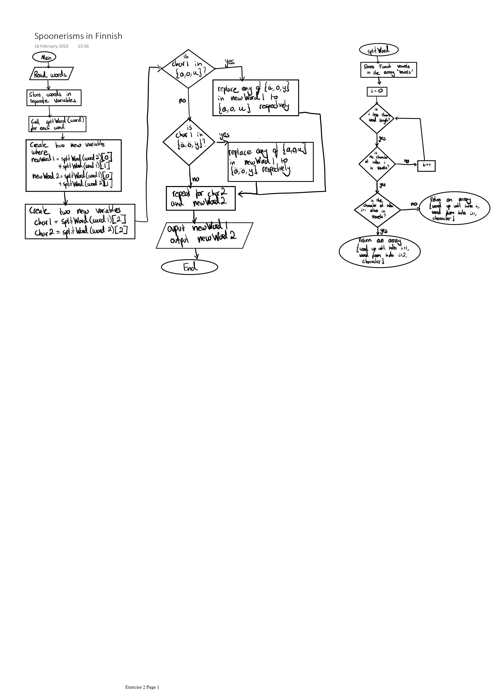

# First design #

- **Joseph O'Keefe**
- **s2286607**
- **23**
- **Fiona McNeill**
- 2023-02-16

# Diagram #



# Algorithm pseudo-code #

```

DEFINE splitWord(word) DO
   vowels := {"a", ..., "ä", "ö"}
   WHILE i < LEN word DO
      FOR letter IN vowels DO
         IF word[i] = letter DO
            IF word[i+1] = word[i] DO
               RETURN {word[0 to i+1], word[i+2 to LEN word], letter}
            ELSE DO
               RETURN {word[0 to i], word[i+1 to LEN word], letter} 
            ENDIF
         ENDIF
      ENDFOR
      i := i+1
   ENDWHILE
   

DEFINE charChanger(word, character) DO
   IF character IN {a,o,u} DO
      FOR letter IN word DO
         IF letter IN {ä, ö, y} DO
            n := {ä, ö, y} INDEX letter
            word[INDEX letter] := {a, o, u}[n]
         ENDIF
      ENDFOR
   ELSE IF character IN {ä, ö, y} DO
      FOR letter IN word DO
         IF letter IN {a, o, u} DO
            n := {a, o, u} INDEX letter
            word[INDEX letter] := {ä, ö, y}[n]
         ENDIF
      ENDFOR
   ENDIF
   RETURN word

word1 := INPUT
word2 := INPUT
newWord1 := splitWord(word2)[0] + splitWord(word1)[1]
newWord2 := splitWord(word1)[0] + splitWord(word2)[1]
char1 := splitWord(word1)[2]
char2 := splitWord(word2)[2]

OUTPUT charChanger(newWord1, char1)
OUTPUT charChanger(newWord2, char2)


```

<STYLE>
* {
  font-size:   0.75rem;
  /*font-size:   1.2rem;*/
  /*font-size:   0.9rem;*/
  background-color: #2A252A;
  color:            #D5DAD5;
  /*background-color: DarkSlateGray;*/
  /*color:            AntiqueWhite;*/
  /*background-color: black;*/
  /*color: white;*/
  /*background-color: white;*/
  /*color: black;*/
}
body {
  width: 80%;
  font-family: "OpenDyslexic", serif;
  /*font-family: sans-serif;*/
  line-height: 180%;
  /*line-height: 200%;*/
}
pre,
code,
pre code {
  font-family: "OpenDyslexicMono", monospace;
  line-height: 150%;
}
ol,
ol ol,
ol ol ol {
  list-style-type: decimal;
}
em {
  font-style: normal;
  border-bottom-style: solid;
  border-bottom-width: 1px;
  padding-bottom:      2px;
  /*text-decoration: underline;*/
  text-decoration-skip-ink: auto;
}
h2 {
  border-top:  1px solid #D5DAD5;
  margin-top:  80px;
  padding-top: 20px;
  }
</STYLE>
