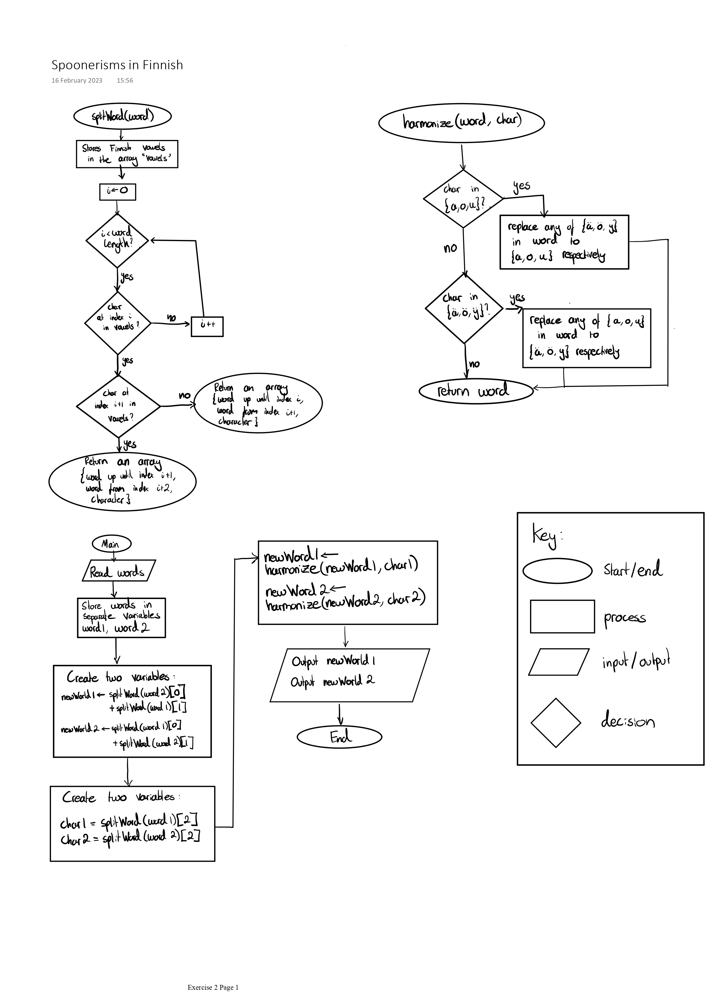

# Explaining the challenge to a beginner #

- **Joseph O'Keefe**
- **s2286607**
- **23**
- **Fiona McNeill**
- 2023-03-09

# Description #
This worksheet is aimed at beginners with some prior programming experience;
at least with the fundamentals (loops, conditionals, arrays, etc.)

Think you can handle a bit of verbal play in one of the most notoriously
difficult languages to learn?

'Spoonerisms in Finnish' is a challenge involving implementing an algorithm to
'spoonerise' Finnish words. Here, this involves taking two Finnish words,
and swapping the first part of each word (up until the first vowel) with the
other.

For example:

```
tarja halonen -> harja talonen
mikkelin kittaajat -> kikkelin mittaajat
```

Here, in Finnish, vowels are ```a,e,i,o,u,y,ä,ö``` and consonants are
```bcdfghjklmnpqrstvwx```.

However, there are some special cases to be aware of:

**Long vowels** occur when the same vowel occurs consecutively. These must
also be swapped, ensuring the length of each word stays the same.

For example:

```
kisko kaappi -> kasko kiippi
sanan muunnos -> munan saannos
```

Additionally, **vowel harmony** is another rule in Finnish whereby any of the
following vowels ```a,o,u``` should not be in the same word as the vowels
```ä,ö,y```, and here the first vowel takes precedence.

For example:

```
köyhä kontti -> kouha köntti
häipyvät tavut -> taipuvat hävyt
```

There are other special cases, but it is not required to consider these
(Finnish is a very complex language).

The challenge is to spoonerise two Finnish words using these rules.

Hint: If you are struggling to implement vowel harmony, try first to
implement the other rules, then create a function that changes the vowels in
each word as required.

# Original challenge question from codegolf #

[Short link to codegolf challenge](https://codegolf.stackexchange.com/questions/167513/spoonerise-words-in-finnish)


<STYLE>
* {
  font-size:   1rem;
  /*font-size:   1.2rem;*/
  background-color: #2A252A;
  color:            #D5DAD5;
  /*background-color: DarkSlateGray;*/
  /*color:            AntiqueWhite;*/
  /*background-color: black;*/
  /*color: white;*/
  /*background-color: white;*/
  /*color: black;*/
  }
  body {
  width: 80%;
  font-family: "OpenDyslexic", serif;
  /*font-family: sans-serif;*/
  line-height: 180%;
  /*line-height: 200%;*/
  }
  pre,
  code,
  pre code {
  font-family: "OpenDyslexicMono", monospace;
  line-height: 150%;
  }
  ol,
  ol ol,
  ol ol ol {
  list-style-type: decimal;
  }  
  em {
  font-style: normal;
  border-bottom-style: solid;
  border-bottom-width: 1px;
  padding-bottom:      2px;
  /*text-decoration: underline;*/
  text-decoration-skip-ink: auto;
  }
  h2 {
  margin-top:  40px;
  padding-top: 10px;
  font-size: 1rem;
  }
</STYLE>

# Diagram #



Here, we start off creating two functions splitWord (to separate the parts
we want to swap) and harmonize (to implement vowel harmony) then call these
in main for each word. The finished words are stored into newWord1 and
newWord2 and then outputted.

# Algorithm pseudo-code #

```

DEFINE splitWord(word) DO
   vowels := {"a", ..., "ä", "ö"}
   WHILE i < LEN word DO
      FOR letter IN vowels DO
         IF word[i] = letter DO
            IF word[i+1] = word[i] DO
               RETURN {word[0 to i+1], word[i+2 to LEN word], letter}
            ELSE DO
               RETURN {word[0 to i], word[i+1 to LEN word], letter} 
            ENDIF
         ENDIF
      ENDFOR
      i := i+1
   ENDWHILE
   

DEFINE harmonize(word, character) DO
   IF character IN {a,o,u} DO
      FOR letter IN word DO
         IF letter IN {ä, ö, y} DO
            n := {ä, ö, y} INDEX letter
            word[INDEX letter] := {a, o, u}[n]
         ENDIF
      ENDFOR
   ELSE IF character IN {ä, ö, y} DO
      FOR letter IN word DO
         IF letter IN {a, o, u} DO
            n := {a, o, u} INDEX letter
            word[INDEX letter] := {ä, ö, y}[n]
         ENDIF
      ENDFOR
   ENDIF
   RETURN word

word1 := INPUT
word2 := INPUT
newWord1 := splitWord(word2)[0] + splitWord(word1)[1]
newWord2 := splitWord(word1)[0] + splitWord(word2)[1]
char1 := splitWord(word1)[2]
char2 := splitWord(word2)[2]

OUTPUT harmonize(newWord1, char1)
OUTPUT harmonize(newWord2, char2)


```

